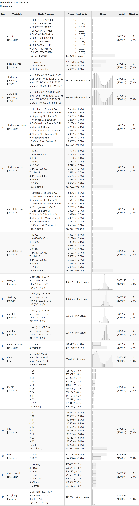
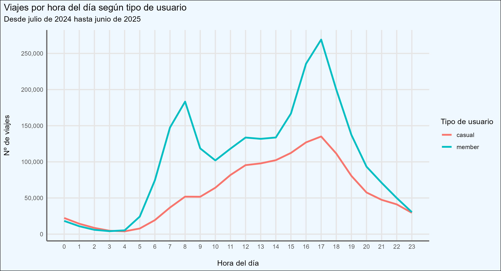
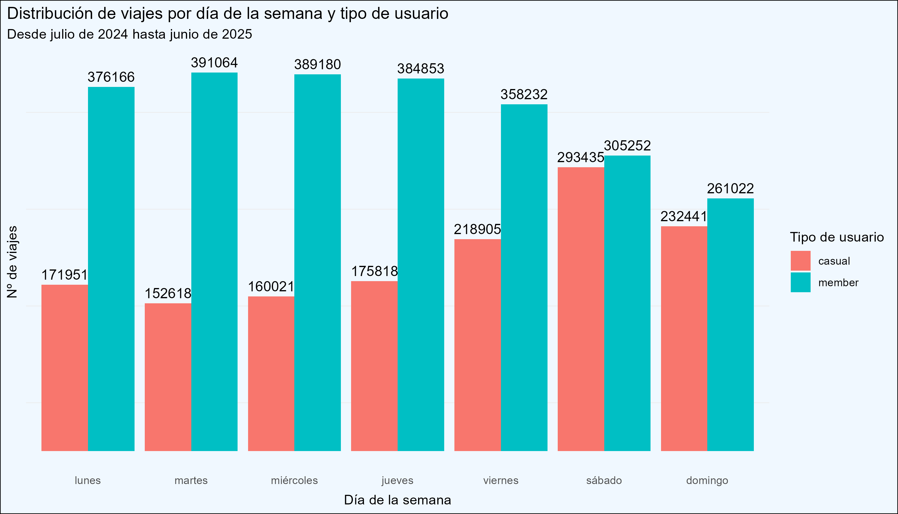
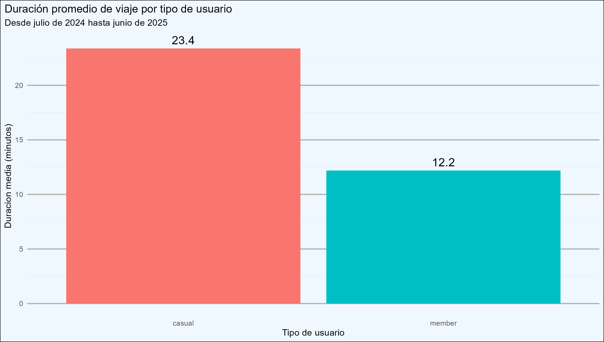
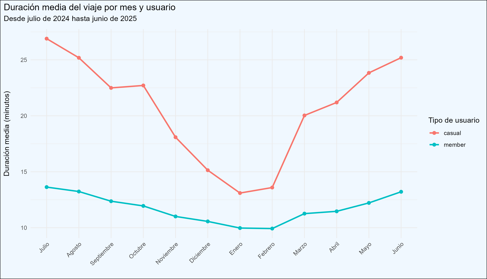
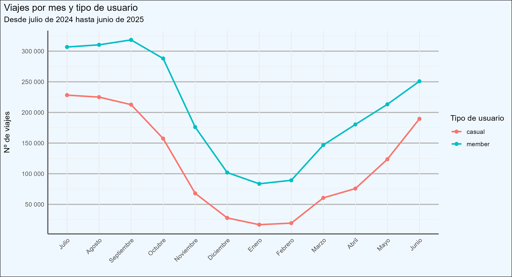
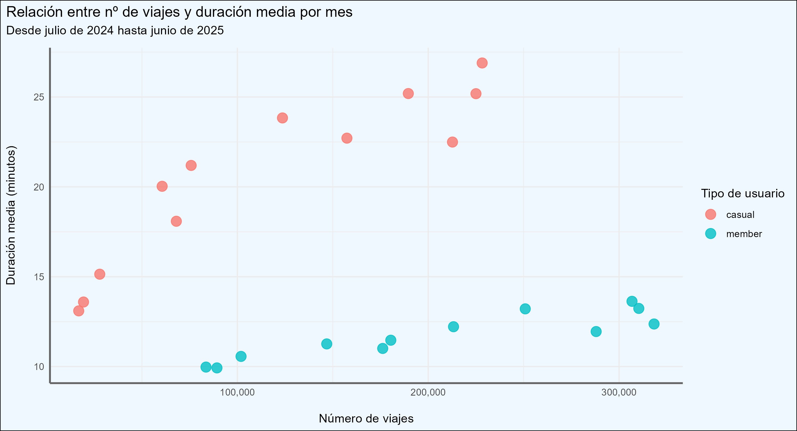
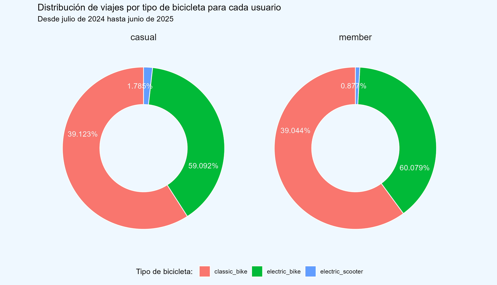
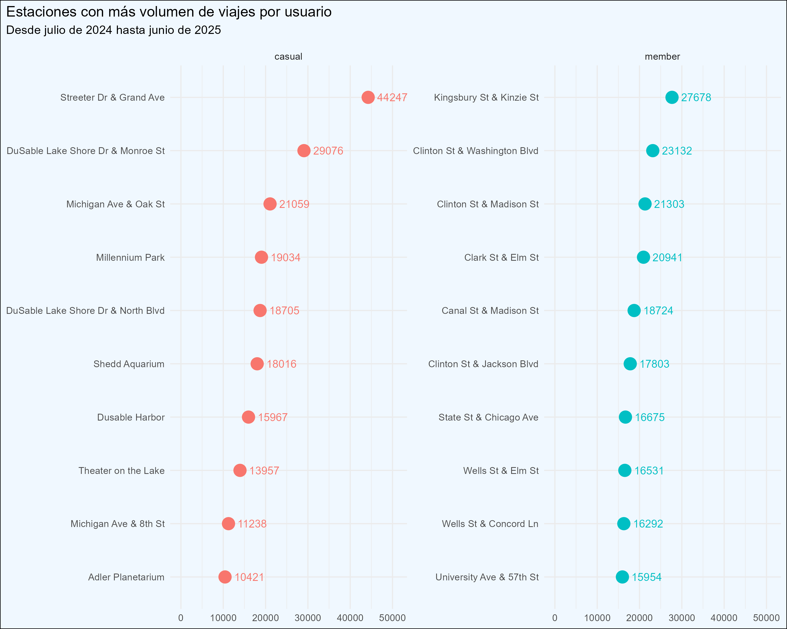
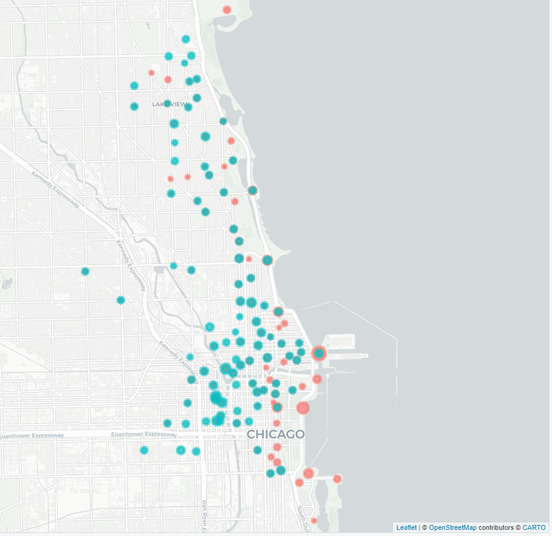

# Cyclistic-Google_Data_Analytics

Este repositorio documenta el proyecto final del Certificado profesional de Análisis de Datos de Google.  

El objetivo principal es aplicar el proceso completo de análisis para resolver un problema empresarial simulado, siguiendo las seis etapas fundamentales:
**Preguntar, Preparar, Procesar, Analizar, Compartir y Actuar**. Cada paso contribuye a desarrollar habilidades técnicas y estratégicas clave para la toma de decisiones basada en datos.

## 🎬 Escenario
Como analista de datos junior en el equipo de marketing de una empresa de bicicletas compartidas en Chicago, denominada Cyclistic, tu tarea consiste en analizar las diferencias de uso entre los **usuarios ocasionales** y los **miembros anuales**.  

La directora de marketing considera que aumentar el número de suscipciones anuales es clave para el éxito del negocio.  

El objetivo es identificar patrones de comportamiento que sirvan de base para una nueva estrategia de marketing enfocada en convertir usuarios casuales en suscriptores. Las recomensaciones deberán estar respaldadas por datos sólidos y visualizaciones profesionales, ya que serán presentadas ante el equipo ejecutivo para su aprobación.

### 💼 Personajes y equipos

- **Cyclistic**: Empresa con más de 5800 bicicletas y 600 estaciones distribuidas por Chicago. Además de los modelos tradicionales, ofrece opciones asistidas como triciclos de mano, bicicletas reclinadas y de carga, promoviendo un sistema más inclusivo para personas con discapacidad o necesidades específicas. Aunque la mayoría de los usuarios viajan por ocio, cerca del 30% utiliza el servicio para desplazarse al trabajo.
- **Lily Moreno**: Directora de marketing y responsable del desarrollo de campañas para promover el servicio. Supervisa iniciativas en distintos canales como redes sociales, email y otros medios digitales.
- **Equipo de analistas de marketing**: Grupo encargado de recopilar, analizar y reportar datos que orienten la estrategia de marketing. Como analista junior, llevas seis meses dentro del equipo, familiarizándote con los objetivos del negocio y con el papel que puede desempeñar el análisis de datos para alcanzarlos.
- **Equipo ejecutivo**: Orientado a los detalles, decidirán si se aprueba el programa de marketing recomendado.

### 🏙️ Sobre la empresa
Cyclistic es un programa de bicibletas compartidas lanzado en 2016 en la ciudad de Chicago. A lo largo de los años ha crecido hasta contar con más de **5.800 bicicletas geolocalizadas y 692 estaciones**, lo que permite a los usuarios recoger y devolver bicicletas en cualquier punto.  

Su estrategia de marketing se ha centrado en atraer públicos amplios mediante una oferta flexible de tarifas: abonos de un viaje, abonos de día completo y membresías anuales. Los clientes esporádicos (pases únicos o diarios) son considerados usuarios casuales, mientras que quienes adquieren la membresía anual son miembros de Cyclistic.  

Aunque esta flexibilidad ha atraído a muchos clientes, los analistas financieros han concluido que los miembros anuales son significativamente más rentables. Por eso, en lugar de crear una campaña de marketing dirigida a nuevos clientes, Lily Moreno cree que existe una gran oportunidad para **convertir usuarios ocasionales en socios**, aprovechando que estos ya conocen y utilizan el servicio.  

Para lograrlo, es clave entender mejor las diferencias entre ambos perfiles, qué motivaría a un usuario casual a adquirir una membresía y qué papel puede jugar el marketing digital en esa transicción. El análisis de datos histórico de viajes será fundamental para identificar patrones y diseñar estrategias efectivas.

## ❓ Preguntar  
En esta fase se define claramente el problema de negocio que se busca resolver mediante el análisis de datos.  

### Tarea Empresarial  
Cyclistic busca aumentar el número de miembros anuales, ya que estos generan más ingresos que los usuarios ocasionales. El objetivo es entender cómo se comportan ambos grupos de usuarios y en qué se diferencian.  
El análisis permitirá identificar patrones de comportamiento clave que puedan usarse para diseñar campañas de marketing digital mejor segmentadas, aumentando la probabilidad de que usuarios ocasionales se conviertan en miembros anuales.

### Pregunta clave a responder
¿Cómo varía el uso de las bicicletas entre usuarios ocasionales y los miembros anuales?

### Interesados clave  
Este estudio será compartido con:
- La directora de marketing, Lily Moreno  
- El equipo ejecutivo de Cyclistic  
- El equipo de análisis de marketing  

## 🗃️ Preparar  
Descripción de los datos recopilados, su origen, estructura y organización  

### Fuente de datos  
Se utilizaron datos históricos de viajes en bicicleta del sistema [Divvy](https://divvy-tripdata.s3.amazonaws.com/index.html), originalmente recopilados por Motivate International Inc. y actualmente gestionados por Lyft Bikes and Scooters, LLC.  
Los datos corresponden al periodo entre **julio de 2024 y junio de 2025**. Esta información es pública, anónima y de libre uso, con restricciones relacionadas a la privacidad de los usuarios.  
### Estructura de los datos  
Los datos están organizados en archivos mensuales en formato .csv, cada uno de los cuales contiene registros individuales de cada viaje: id del viaje, tipo de bicicleta (clasica,eléctrica o scooter eléctrica), fecha y hora de inicio y fin, nombre, identificador y coordenadas de la estación de partida y de llegada, y tipo de usuario (casual o miembro).  
### Consideraciones sobre privacidad y licencia  
Los datos son públicos y anónimos, proporcionados bajo una licencia que permite su uso y análisis para fines legítimos. Está prohibido identificar usuarios o vender los datos como conjunto independiente. Para más detalles, consultar la [licencia](https://divvybikes.com/data-license-agreement).  
### Verificación e integridad
Se realizó una revisión preliminar para asegurar que todos los archivos estuvieran completos, sin columnas faltantes ni datos corruptos evidentes. También se verificó que las categorias y formatos de campos clave (fechas, duración, tipo de usuario) fueran consistentes y adecuados para continuar el análisis.
### Utilidad para el análisis  
Estos datos provienen de una fuente oficial, son confiables y permiten identificar patrones de uso entre usuarios ocasionales y miembros anuales, lo cual es esencial para responder a la pregunta de negocio planteda en la fase anterior.

## 🛠️ Procesar  
Descripción del tratamiento y limpieza de los datos para prepararlos para el análisis.  
La herramienta usada para manipular los datos es RStudio.  

### Bibliotecas  
Durante esta fase se utilizaron las siguientes bibliotecas:
```r
# colección de paquetes para importar, manipular y visualizar datos
install.packages("tidyverse")
library("tidyverse")
# facilita el trabajo con fechas y horas
install.packages("lubridate")
library("lubridate")
# janitor: útil para limpiar nombres de columnas y detectar inconsistencias
install.packages("janitor")
library("janitor")
# dplyr: parte de tidyverse, permite filtrar, seleccionar y transformar datos fácilmente
install.packages("dplyr")
library("dplyr")
# summarytools: genera resúmenes estadísticos detallados y tablas descriptivas de forma rápida
install.packages("summarytools")
library("summarytools")

library(scales)
library(ggplot2)
```
### Lectura  
Leemos los 12 archivos .csv con los datos correspondientes a cada mes y los asignamos a un objeto. Este objeto será un dataframe.
```r
trips_202407 <- read.csv("202407-divvy-tripdata.csv")
trips_202408 <- read.csv("202408-divvy-tripdata.csv")
trips_202409 <- read.csv("202409-divvy-tripdata.csv")
trips_202410 <- read.csv("202410-divvy-tripdata.csv")
trips_202411 <- read.csv("202411-divvy-tripdata.csv")
trips_202412 <- read.csv("202412-divvy-tripdata.csv")
trips_202501 <- read.csv("202501-divvy-tripdata.csv")
trips_202502 <- read.csv("202502-divvy-tripdata.csv")
trips_202503 <- read.csv("202503-divvy-tripdata.csv")
trips_202504 <- read.csv("202504-divvy-tripdata.csv")
trips_202505 <- read.csv("202505-divvy-tripdata.csv")
trips_202506 <- read.csv("202506-divvy-tripdata.csv")
```
### Unión 
Lo ideal es trabajar con un único dataset, por lo que procederemos a unificar todos en uno solo. Sin embargo, antes será necesario comprobar que compartan las mismas columnas y tipos de datos.  
Primero, verificamos que los 12 dataframes tengan exactamente las mismas columnas, en el mismo orden.
```r
# Guardar los nombres de las columnas de los conjuntos de datos
column_names <- list(
    df1 = names(trips_202407), df2 = names(trips_202408), df3 = names(trips_202409), df4 = names(trips_202410),
    df5 = names(trips_202411), df6 = names(trips_202412), df7 = names(trips_202501), df8 = names(trips_202502),
    df9 = names(trips_202503), df10 = names(trips_202504), df11 = names(trips_202505), df12 = names(trips_202506)
)
# Comprobar si todos tienen exactamente los mismos nombres de columna y en el mismo orden
all_same <- all(sapply(column_names, function(x) identical(x, column_names[[1]])))
# Si todos tienen las mismas columnas y en el mismo orden, devolverá TRUE
print(all_same)
```
Ahora toca comprobar para cada columna que contenga el mismo tipo de dato en cada archivo.
```r
# Guardar en una lista el tipo de cada columna de cada data frame
column_types <- list(
    df1 = sapply(trips_202407, class), df2 = sapply(trips_202408, class), df3 = sapply(trips_202409, class),
    df4 = sapply(trips_202410, class), df5 = sapply(trips_202411, class), df6 = sapply(trips_202412, class),
    df7 = sapply(trips_202501, class), df8 = sapply(trips_202502, class), df9 = sapply(trips_202503, class),
    df10 = sapply(trips_202504, class), df11 = sapply(trips_202505, class), df12 = sapply(trips_202506, class)
)
# Comprobar si todos las columnas son del mismo tipo
all_types_same <- all(sapply(column_types, function(x) identical(x, column_types$df1)))
# Devolverá TRUE si todos los data frames tienen exactamente los mismos tipos de columnas
print(all_types_same)
```
Una vez hemos comprobado que todos los conjuntos de datos tienen las mismas columnas, en el mismo orden y con el mismo tipo de datos, procedemos a unirlos en un único data frame.
```r
trips_202407_202506 <- bind_rows(
    trips_202407,trips_202408,trips_202409,trips_202410,trips_202411,trips_202412,
    trips_202501,trips_202502,trips_202503,trips_202504,trips_202505,trips_202506
)
```
### Añadir
Para facilitar el análisis, se crearán unas columnas para indicar el día, mes, año y duración del viaje. 
```r
# Añade columna donde se guarda solo la fecha, sin la hora
trips_202407_202506$date <- as.Date(trips_202407_202506$started_at)
# Columna para el mes
trips_202407_202506$month <- format(as.Date(trips_202407_202506$date), "%m")
# Columna para guardar el día
trips_202407_202506$day <- format(as.Date(trips_202407_202506$date), "%d")
# Columna donde se guarda el año
trips_202407_202506$year <- format(as.Date(trips_202407_202506$date), "%Y")
# Columna para guardar el día de la semana
trips_202407_202506$day_of_week <- format(as.Date(trips_202407_202506$date), "%A")

# Añadir una variable para la duración del viaje en minutos
trips_202407_202506$ride_length <- difftime(trips_202407_202506$ended_at,trips_202407_202506$started_at,units="mins")
# Convertimos el atributo creado a un valor numérico y lo redondeamos a 3 decimales
trips_202407_202506$ride_length <- as.numeric(as.character((trips_202407_202506$ride_length)))
trips_202407_202506$ride_length <- round(trips_202407_202506$ride_length, 3)
```
### Limpieza  
Vamos a comprobar si los valores de la columna ride_id son únicos.  
Para saber si no hay un id repetido, contaremos el número de valores distintos, si es igual al número de filas (5.597.030), entonces ya contamos con un identificador único para cada fila del dataset.
En ese caso, no será necesario generar un nuevo identificador, ya que el campo id cumple esa función correctamente.
```r
trips_202407_202506 %>% summarise(valores_distintos = n_distinct(ride_id))
# Salida
valores_distintos: 5597030
```
Se analizarán los valores únicos de algunas columnas para detectar posibles errores tipográficos, entradas inconsistentes o categorías no esperadas.
```r
# Comprobar que solo haya 3 tipos de bici (electric, classic y scooter)
trips_202407_202506 %>% distinct(rideable_type)
# Salida        
1 electric_bike   
2 classic_bike    
3 electric_scooter

# Comprobar que solo haya 2 tipos de usuario (member y casual)
trips_202407_202506 %>% distinct(member_casual)
# Salida      
1 casual       
2 member
```
Es fundamental asegurarse de que los datos sean consistentes y estén libres de errores que puedan afectar los resultados. Primero, se va a identificar las columnas con valores nulos.
```r
colSums(is.na(trips_202407_202506))
# Resultado
           ride_id      rideable_type         started_at           ended_at start_station_name   start_station_id 
                 0                  0                  0                  0            1088824            1088824 
  end_station_name     end_station_id          start_lat          start_lng            end_lat            end_lng 
           1119485            1119485                  0                  0               6030               6030 
     member_casual               date              month                day               year        day_of_week 
                 0                  0                  0                  0                  0                  0 
       ride_length 
                 0 
```
Como se puede apreciar, hay algunos registros en los que las coordenadas de la estación final (end_lat y end_lng) están ausentes, concretamente 6030 registros. Se podría intentar completar los datos faltantes a partir de los nombres de las estaciones, por lo que primero verificaremos si también carecen de dicho nombre. En caso de no tenerlo, los registros serán eliminados.
```r
# Averiguar si hay alguna fila con nombre de estación pero sin coordenadas
sum(!is.na(trips_202407_202506$end_station_name) & is.na(trips_202407_202506$end_lat))
# Resultado
[1] 0

# No hay, por tanto procedemos a borrar las filas con valores nulos para las columnas end_lat y end_lng
trips_202407_202506 <-  trips_202407_202506[!is.na(trips_202407_202506$end_lat), ]

```
En el caso de los viajes que no cuentan con información en los campos de nombres e id de estaciones (tanto de inicio como de fin), se optará por eliminarlos del conjunto principal de datos, previamente almacenándolos en un dataset aparte por si en el futuro se decida intentar su recuperación.  
La única opción para completar esta información sería a partir de las coordenadas geográficas. No obstante, esta tarea resulta compleja, ya que las coordenadas no son completamente consistentes: no todos los viajes asociados a una misma estación comparten exactamente los mismos valores de latitud y longitud, lo que dificulta su identificación automática.
```r
# Guardar los registros con campos vacíos en un dataset
viajes_incompletos <- trips_202407_202506 %>% 
  filter(is.na(start_station_name) | is.na(end_station_name))
# Eliminar las filas con valores vacíos del dataset principal
trips_202407_202506 <- drop_na(trips_202407_202506) 
```
Se detectaron que algunas estaciones aparecen registradas con dos variantes de nombre: una con un asterisco (*) y otra sin él. Esto generará duplicados en el análisis, ya que R las trata como estaciones diferentes aunque correspondan a la misma ubicación física.  
Para evitar esta confusión y unificar la información, se procederá a identificar todas las estaciones cuyos nombres terminan con un asterisco, verificar si existe una versión sin asterisco asociada al mismo id de estación y eliminar el asterisco para consolidar todas las variantes en una sola representación estándar.
```r
# obtener los IDs con nombre que termina en asterisco
ids_con_asterisco <- trips_202407_202506 %>%
  filter(grepl("\\*$", start_station_name)) %>%
  distinct(start_station_id) %>%
  pull(start_station_id)

# Mostrar todos los nombres asociados
nombres_por_id <- trips_202407_202506 %>%
  filter(start_station_id %in% ids_con_asterisco) %>%
  distinct(start_station_id, start_station_name) %>%
  arrange(start_station_id)

# Mostrar resultado
print(nombres_por_id)

   start_station_id start_station_name           
   <chr>            <chr>                        
 1 13017            Franklin St & Chicago Ave    
 2 13017            Franklin St & Chicago Ave*   
 3 13154            Sheffield Ave & Kingsbury St 
 4 13154            Sheffield Ave & Kingsbury St*
 5 13192            Halsted St & Dickens Ave     
 6 13192            Halsted St & Dickens Ave*    
 7 13208            Burling St & Diversey Pkwy   
 8 13208            Burling St & Diversey Pkwy*  

# algunas estaciones presentan dos variantes en su nombre, ambas asociadas al mismo identificador
# Se procederá a eliminar el asterisco del nombre para unificar las denominaciones.  
trips_202407_202506$start_station_name <- gsub("\\*$", "", trips_202407_202506$start_station_name)
trips_202407_202506$end_station_name <- gsub("\\*$", "", trips_202407_202506$end_station_name)
```
También se ha observado que algunos IDs están asociados a más de una estación. En ciertos casos, se debe a pequeñas variaciones en la nomenclatura del nombre de la estación, es decir, probablemente sea la misma; sin embargo, en otros, las diferencias en los nombres son mayores o incluso completamente distintas. Los cambios en los nombres asociados a un mismo ID pueden deberse a múltiples causas. Por ejemplo, dado que el dataset reúne varios conjuntos de datos temporales, es posible que un mismo ID corresponda a una estación en un mes y a otra diferente en otro período. Debido a esta incertidumbre, no se realizarán más modificaciones en los nombres de estaciones.      
NOTA: Anotar que una misma estación puede tener más de un id distinto, esto se debe a que se han cambiado los ids para algunas de ellas. Por ejemplo, para Yates Blvd & 93rd St tenemos el id 20237 y CHI00856.  
    
Ahora se procederá a eliminar aquellos viajes que presentan errores en su duración, tales como aquellos con duración negativa, así como los viajes cortos — de menos de 2 minutos — que no se dirigen a una estación distinta. Se entiende que estos casos corresponden a viajes cancelados, devoluciones de bicicleta o cambios debido a algún fallo.
```r
trips_202407_202506 <- trips_202407_202506 %>%
     filter(ride_length >= 0, !(ride_length < 2 & start_station_name == end_station_name))
```
Se verificó la existencia de viajes con duraciones extremadamente largas, se encontró que solo unos pocos exceden un día completo (1,440 minutos), y lo hacen por un margen muy reducido. Por lo tanto, se considera que estos casos no justifican su eliminación del conjunto de datos.<br><br>     

Tras completar el proceso de limpieza y transformación, se obtiene un conjunto de datos estructurado y listo para el análisis. A continuación, se presenta un resumen descriptivo de las variables incluidas en el dataset final, que permite verificar la integridad, el tipo de datos y la distribución general de los valores.  

Este resumen ha sido generado utilizando la función dfSummary() del paquete summarytools, que proporciona una visión rápida y clara del contenido del dataset.


## 📈 Analizar 
A través de estadísticas descriptivas y visualizaciones, se examinan aspectos como la duración de los viajes, los patrones de uso por día de la semana, y las rutas más comunes, con el fin de entender mejor cómo y cuándo utilizan el servicio ambos tipos de usuarios.  
Todos los gráficos presentados estarán segmentados según el tipo de usuario ya que el principal objetivo es entender las diferencias en comportamiento entre los distintos usuarios. Esto nos permitirá comparar patrones, tendencias y características específicas para cada grupo.  

### *Distribución de viajes por hora del día*  
Primero analizaremos cómo se distribuyen los viajes a lo largo del día.
```r
trips_202407_202506 %>%
  group_by(member_casual, start_hour = hour(started_at)) %>%
  summarise(n_viajes = n(), .groups = "drop") %>%
  ggplot(aes(x = start_hour, y = n_viajes, color = member_casual)) +
  geom_line(size = 1.2) +
  scale_x_continuous(breaks = 0:23) +
  labs(
    title = "Viajes por hora del día según tipo de usuario",
    subtitle = "Desde julio de 2024 hasta junio de 2025",
    x = "Hora del día",
    y = "Nº de viajes",
    color = "Tipo de usuario"
  ) +
  scale_y_continuous(
    labels = scales::comma,
    breaks = scales::pretty_breaks(n = 10)
  ) +
  theme_minimal() +
  theme(
    plot.subtitle = element_text(margin = margin(b = 10)),
    plot.title.position = "plot",
    plot.background = element_rect(fill = "aliceblue"),
    axis.title.x = element_text(margin = margin(t = 15)),
    axis.title.y = element_text(margin = margin(r = 15)),
    panel.grid.minor = element_blank(),
    axis.line = element_line(color = "gray40", size = 0.8),
    panel.grid.major = element_line(color = "gray90", size = 0.8)
  )
```
  
El número de viajes para los usuarios casual tiene un crecimiento bastante constante hasta las 5 de la tarde, por el contrario, para los usuarios con membresía vemos dos picos claros. Es posible que muchos de estos usuarios hagan uso de las bicicletas para desplazarse al trabajo, ya que los picos coinciden con las horas típicas de inicio y fin de la jornada laboral.

### *Número de viajes por día de la semana*  
Analizaremos la distribución del número total de viajes que hace cada tipo de usurio para cada día de la semana.
```r
trips_202407_202506 %>%
  group_by(member_casual, day_of_week) %>%
  summarise(total_viajes = n(), .groups = "drop") %>%
  mutate(day_of_week = factor(day_of_week,
    levels = c("lunes", "martes", "miércoles", "jueves", "viernes", "sábado", "domingo"))) %>%
  ggplot(aes(x = day_of_week, y = total_viajes, fill = member_casual)) +
  geom_bar(stat = "identity", position = "dodge") +
  geom_text(aes(label = total_viajes), position = position_dodge(width = 0.9),
    vjust = -0.5, size = 4) +
  labs(title = "Distribución de viajes por día de la semana y tipo de usuario",
    subtitle = "Desde julio de 2024 hasta junio de 2025",
    x = "Día de la semana",
    y = "Nº de viajes",
    fill = "Tipo de usuario") +
  theme_minimal() + 
  theme(plot.subtitle = element_text(margin = margin(b = 10)),
    plot.title.position = "plot",
    plot.background = element_rect(fill = "aliceblue"),
    axis.text.y = element_blank(),
    axis.title.x = element_text(margin = margin(t = 7)),
    panel.grid.major = element_blank())
```
  
Los usuarios con membresía anual usan las bicicletas principalmente entre semana, probablemente para transporte diario. En cambio, los usuarios casuales las usan más los viernes y fines de semana, lo que sugiere un uso recreativo o turístico.

### *Duración de los viajes para cada usuario*  
Vamos a calcular la duración media de los viajes para cada tipo de usuario (casual y member).  
```r
trips_202407_202506 %>% 
  group_by(member_casual) %>% 
  summarise(avg_ride_length = mean(ride_length)) %>% 
  ggplot(aes(x = member_casual, y = avg_ride_length, fill = member_casual)) +
  geom_bar(stat = "identity", show.legend = FALSE) +
  geom_text(aes(label = round(avg_ride_length, 1)), vjust = -0.5, size = 5) +
  labs(title = "Duración promedio de viaje por tipo de usuario",
    subtitle = "Desde julio de 2024 hasta junio de 2025", 
    x = "Tipo de usuario", y = "Duracion media (minutos)") +
  theme_minimal() + 
  theme(plot.subtitle = element_text(margin = margin(b=10)), plot.title.position =  "plot",
    plot.background = element_rect(fill = "aliceblue"),
    panel.grid.major.y = element_line(color = "gray70", size = 0.7),
    panel.grid.major.x = element_blank())
```
  
Vemos que la duración de viaje de los usuarios casuales es el doble que la de los usuarios miembros. Los miembros tienden a hacer viajes más cortos y directos, posiblemente como parte de su rutina diaria.

### *Duración media de los viajes por mes*  
Ahora calcularemos el promedio de los viajes pero por mes. 
```r
trips_202407_202506 %>% 
  group_by(month, member_casual) %>% 
  summarise(duracion_media = mean(ride_length, na.rm = TRUE), .groups = "drop") %>% 
  ggplot(aes(x = factor(month, levels = orden_meses), y = duracion_media, 
    color = member_casual, group = member_casual)) +
  geom_line(linewidth = 1) +
  geom_point(size = 2) +
  scale_y_continuous(labels = label_number()) +
  scale_x_discrete(labels = nombres_meses, expand = expansion(add = 0.5)) +
  labs(title = "Duración media del viaje por mes y usuario", 
    subtitle = "Desde julio de 2024 hasta junio de 2025",
    x = "", y = "Duración media (minutos)", color = "Tipo de usuario") +
  theme_minimal() +
  theme(axis.text.x = element_text(angle = 45, hjust = 1),
    plot.subtitle = element_text(margin = margin(b=10)), plot.title.position =  "plot",
    plot.background = element_rect(fill = "aliceblue"),
    panel.grid.major.y = element_line(color = "gray70", size = 0.7),
    axis.title.y = element_text(margin = margin(r = 15)),
    axis.line = element_line(color = "gray40", size = 0.8))
```
  
En invierno se observa la menor duración de viaje, posiblemente esto es debido por el clima frío. Sin embargo en los usuarios con membresía el promedio de viaje es bastante estable a lo largo del año y en los casual hay mucha diferencia entre los meses de verano y los de invierno. Esto refuerza la idea de que su uso, en los usuarios casual, es recreativo o turístico.

### *Número de viajes realizados cada mes*  
Visualizaremos en una gráfica lineal la evolución del número de viajes realizados mes a mes.
```r
# Agrupar y contar viajes
orden_meses <- c("07", "08", "09", "10", "11", "12", "01", "02", "03", "04", "05", "06")
nombres_meses <- c("Julio", "Agosto", "Septiembre", "Octubre", "Noviembre", "Diciembre",
                   "Enero", "Febrero", "Marzo", "Abril", "Mayo", "Junio")

trips_202407_202506 %>% 
  group_by(month, member_casual) %>% 
  summarise(total_viajes = n(), .groups = "drop") %>% 
  ggplot(aes(x = factor(month, levels = orden_meses), y = total_viajes, 
    color = member_casual, group = member_casual)) +
  geom_line(linewidth = 1) +
  geom_point(size = 2) +
  scale_y_continuous(labels = label_number(),
    breaks = seq(0, max(viajes_por_mes$total_viajes), by = 50000)) +
  scale_x_discrete(labels = nombres_meses) +
  labs(title = "Viajes por mes y tipo de usuario", 
    subtitle = "Desde julio de 2024 hasta junio de 2025",
    x="", y = "Nº de viajes", color = "Tipo de usuario") +
  theme_minimal() +
  theme(axis.text.x = element_text(angle = 45, hjust = 1),
    plot.subtitle = element_text(margin = margin(b=10)), plot.title.position =  "plot",
    plot.background = element_rect(fill = "aliceblue"),
    panel.grid.major.y = element_line(color = "gray70", size = 0.7),
    axis.title.y = element_text(margin = margin(r = 15)),
    axis.line = element_line(color = "gray40", size = 0.8))
```
  
También vemos en este gráfico una diferencia notable entre los meses de verano y los de invierno. Chicago es una ciudad con inviernos fríos, por tanto el clima extremo causa un descenso considerable del número de viajes.

### *Relación entre nº de viajes y duración media mensual*  
Ahora podemos ver la relación entre los valores de las dos visualizaciones anteriores en un gráfico de dispersión.  
```r
trips_202407_202506 %>%
  group_by(month, member_casual) %>%
  summarise(
    total_viajes = n(),
    duracion_media = mean(ride_length, na.rm = TRUE),
    .groups = "drop"
  ) %>%
  ggplot(aes(x = total_viajes, y = duracion_media, color = member_casual)) +
  geom_point(size = 4, alpha = 0.8) +
  scale_x_continuous(labels = scales::comma) +
  labs(
    title = "Relación entre nº de viajes y duración media por mes",
    subtitle = "Cada punto representa un mes",
    x = "Número de viajes",
    y = "Duración media (minutos)",
    color = "Tipo de usuario"
  ) +
  theme_minimal() +
  theme(
    plot.subtitle = element_text(margin = margin(b=10)),
    plot.title.position = "plot",
    plot.background = element_rect(fill = "aliceblue"),
    axis.title.y = element_text(margin = margin(r = 15)),
    axis.title.x = element_text(margin = margin(t = 15)),
    axis.line = element_line(color = "gray40", size = 0.8)
  )
```
  
Como ya vimos en el gráfico anterior, el uso en cantidad varía estacionalmente. Los usuarios con membresía mantienen una duración de viaje bastante constante y los usuarios casuales muestran una gran variabilidad. 

### *Distribución de viajes según el tipo de bicicleta*  
Realizaremos un gráfico que nos permitirá visualizar qué proporción del total de viajes corresponde a cada tipo de bicicleta.
```r
trips_202407_202506 %>% 
  group_by(member_casual, rideable_type) %>%
  summarise(num_viajes = n()) %>%
  mutate(proporción = num_viajes / sum(num_viajes),
    label_pos = cumsum(proporción) - proporción / 2) %>%
  ggplot(aes(x = 2, y = proporción, fill = rideable_type)) +
  geom_bar(stat = "identity", color = "white") +
  coord_polar(theta = "y") +
  facet_wrap(~ member_casual) +
  xlim(0.5, 2.5) +
  geom_text(aes(y = label_pos, label = scales::percent(proporción)), color = "white") +
  labs(fill = "Tipo de bicicleta: ",
    title = "Distribución de viajes por tipo de bicicleta para cada usuario",
    subtitle = "Desde julio de 2024 hasta junio de 2025") +
  theme_minimal() +
  theme(legend.position = "bottom",
    panel.grid = element_blank(),
    plot.subtitle = element_text(margin = margin(b=10)), plot.title.position =  "plot",
    plot.background = element_rect(fill = "aliceblue", color = NA),
    strip.text = element_text(size = 13) ,
    axis.text = element_blank(),
    axis.title = element_blank())
```
  
Uso muy similar entre ambos grupos. Solo hay una ligera diferencia en el uso de scooters, lo que puede sugerir que los casuales están más dispuestos a experimentar, posiblemente por curiosidad. Las bicicletas eléctricas superan el 59% de los viajes, lo que muestra una clara preferencia por la asistencia eléctrica, más comodidad y menos esfuerzo físico.

### *Estaciones con mayor volumen de viajes*  
Identificaremos las estaciones que registran el mayor volumen de viajes.
```r
#Estaciones de inicio mas usadas (100 mas usadas)
top_start_stations_names <- trips_202407_202506 %>%
  group_by(member_casual, start_station_name) %>%
  summarise(total_viajes = n(), .groups = "drop") %>%
  group_by(member_casual) %>%
  slice_max(order_by = total_viajes, n = 100) %>%   # <-- slice_max en vez de slice_head
  ungroup()gg
#Estaciones con más volumen de viajes por usuario (top 10)
top_start_stations %>%
  group_by(member_casual) %>%
  slice_max(order_by = total_viajes, n = 10) %>%
  ungroup() %>%
  ggplot(aes(x = total_viajes,
    y = reorder(start_station_name, total_viajes),
    color = member_casual)) +
  geom_line(aes(group = start_station_name)) +
  geom_point(size = 5) +
  geom_text(aes(label = total_viajes), hjust = -0.3, size = 3.5) +
  facet_wrap(~ member_casual, scales = "free_y") +
  labs(title = "Estaciones con más volumen de viajes por usuario",
    subtitle = "Desde julio de 2024 hasta junio de 2025", 
    x = NULL,
    y = NULL,
    color = NULL) +
  theme_minimal() +
  theme(legend.position = "none",
    plot.subtitle = element_text(margin = margin(b=10)), plot.title.position =  "plot",
    plot.background = element_rect(fill = "aliceblue"),
    axis.title.x = element_text(hjust = 0.4, margin = margin(t = 15))) +
  coord_cartesian(xlim = c(0, max(top_start_stations$total_viajes) * 1.15))
```
  
Ninguna estación aparece en el top 10 de ambos grupos, esto no tiene porque ser muy relevante ya que hay casi 700 estaciones, pero puede indicar que puntos de partida preferidos por cada grupo son distintos. La diferencia entre las estaciones más usadas por usuarios member es menor, lo que refuerza la idea de un uso funcional, como transporte diario. Pese a que se realizan muchos más viajes por usuarios con membresía, vemos que las dos estaciones mas usadas por casual tienen muchos mas viajes. Hay una mayor concentración de viajes por parte de los casuals y es probable que estas estaciones estén ubicadas en zonas turísticas, parques o áreas recreativas.

### *Mapa de estaciones más utilizadas*
Se representarán en un mapa georreferenciado los puntos con mayor volumen de actividad.
```r
#Extraer una coordenada fija para cada estación (primer registro que coincida)
estaciones_coords <- trips_202407_202506 %>%
  filter(start_station_name %in% top_start_stations_names$start_station_name) %>%
  distinct(start_station_name, .keep_all = TRUE) %>%
  select(start_station_name, start_lat, start_lng)

#Unir coordenadas a las estaciones top
top_start_stations <- top_start_stations_names %>%
  left_join(estaciones_coords, by = "start_station_name") %>%
  mutate(tipo_usuario = member_casual)

pal_tipo <- colorFactor(c("#F8766D", "#00BFC4"), domain = c("casual", "member"))

leaflet(top_start_stations) %>%
  addProviderTiles("CartoDB.Positron") %>%
  addCircleMarkers(
    lng = ~start_lng,
    lat = ~start_lat,
    radius = ~sqrt(total_viajes) * 0.05,  # radio proporcional a viajes
    color = ~pal_tipo(tipo_usuario),
    stroke = TRUE,
    fillOpacity = 0.7,
    label = ~paste0(start_station_name, "<br>",
      "Usuario: ", tipo_usuario, "<br>",
      "Viajes: ", total_viajes)
  )
```
  
Aquí vemos representadas en el mapa las 100 estaciones de inicio más usadas por cada tipo de usuario. Muchas de ellas si son comunes a ambos miembros, sin embargo, podemos observar como las estaciones con mayor afluencia de usuarios casuales están ubicadas en zonas más turísticas, cerca de parques y a la orilla del lago Michigan.

## 🤝 Compartir  
En este apartado se resumen los insights más relevantes obtenidos del estudio, ofreciendo recomendaciones basadas en el análisis de los patrones de uso de los diferentes tipos de usuarios:    
#### \- Patrones horarios diferentes
- Los usuarios casual usan el servicio de manera más dispersa a lo largo del día, sin horarios punta claros.
- Los usuarios con membresía muestran un patrón de uso concentrado en las horas pico típicas de desplazamiento laboral, con aumentos claros en la mañana y final de la tarde.

#### \- Comportamiento semanal
- Miembros mantienen el número de viajes relativamente constantes de lunes a jueves, con una ligera disminución los viernes y una caída más pronunciada durante el fin de semana.
- En contraste, el mayor uso en los usuarios casuales se da durante los viernes y el fin de semana, alcanzando su punto mácimo los sábados.

#### \- Patrones estacionales y climáticos
- Ambos grupos muestran una gran disminución de viajes durante los meses fríos, algo normal debido al duro clima de la ciudad en invierno.
- Aumentan un poco los viajes realizados por los miembros en septiembre, en contraste con una leve bajada entre los usuarios casuales. Esto coincide con el regreso a la rutina laboral tras el verano, mientras que el mayor incremento de viajes casuales se registra en junio, coincidiendo con el inicio de la temporada turística.
- Aunque el número de viajes disminuye con la llegada del frío, la duración media de los trayectos apenas varía en los usuarios con membresía: en verano el promedio de viaje dura unos 13-14 minutos mientras que en invierno unos 10. En el caso de los usuarios casuales esta diferencia es mucho mayor, pasando de 27 minutos a 13.

#### \- Preferencias de tipo de bicicleta
- Hay un uso similar del tipo de bicicleta y ambos grupos se decantan por las eléctricas (cerca del 60% de los usuarios).
- Los casuales usan scooters en proporción ligeramente mayor, lo que puede indicar mayor experimentación o uso recreativo.

#### \- Distribución geográfica
- Las principales estaciones usadas por los miembros están situadas en el centro de la ciudad, lo que refleja un uso vinculado a la movilidad diaria y a la cercanía a zonas de oficinas.  
- Los usuarios casuales se concentran más en estaciones cercanas a lugares turísticos o recreativos, destacando especialmente la estación Streeter Dr. & Grand Ave., situada junto al muelle del lago y a poca distancia de Milleniun Park, dos de los lugares más visitados de la ciudad.

## 🎯 Actuar
Concretaremos los hallazgos del análisis en recomendaciones prácticas. Se presentan varias sugerencias para mejorar el servicio, baasadas en los patrones de uso detectados. 
### 📌Conclusiones
- Los usuarios con **membresía** usan la bicicleta principalmente como **medio de transporte diario**, con viajes más cortos, directos y frecuentes entre semana. Su actividad disminuye los fines de semana y las estaciones más utilizadas se concentran en el centro de la ciudad.  
- Los usuarios **casuales** hacen un uso más **recreativo**, con viajes más largos, especialmente en verano. Hay un aumento del uso los viernes y durante el fin de semana, y se concentran en zonas turísticas y recreativas.  
### 💡 Sugerencias 
- Dado que gran parte de los usuarios member utilizan el servicio para ir al trabajo, es probable que exista un segmento dentro de los usuarios casuales que también podrían beneficiarse de una suscipción si se les incentivara a darle ese mismo uso cotidiano.  
Para atraer a estos usuarios se pueden realizar campañas dirigidas a trayectos laborales o de rutina, colocando publicidad cerca de estaciones céntricas y residenciales, promocionando la membresía como una opción económica, ecológica y cómoda para ir al trabajo.   
- Algunos usuarios no estarán interesados en una suscripción anual, quizás sería buena idea ofrecer otro tipo de membresías, orientadas a turistas o visitantes frecuentes:
    - Membresías temporales, como pases semanales o de fin de semana, a precio reducido.  
    - Planes recreativo con beneficios específicos, que ofrezcan tarifas reducidas en viajes largos o descuentos por alquilar los viernes, sábados y domingos..  
    - Paquetes turísticos o colaboraciones locales, por ejemplo: "Incluye 5 días de Divvy Pass con la reserva de hotel".
- Si para el uso de la bici es necesario un registro o descarga de app, se podría identificar usuarios casuales con uso frecuente y enviar ofertas personalizadas. Notificar el número de viajes que ya ha realizado y añadir recordatorios de ahorro mediante la membresía. 
- Los usuarios con membresía ya gozan de ciertos beneficios, pero se podrían añadir los siguientes para aumentar su valor y atraer a usuarios casuales:
    - Reducción aún mayor de tarifas para bicicletas eléctricas y scooters.
    - Sistema de recompensas por uso frecuente. Cada cierto número de viajes se otorga una extensión de la membresía, participación en sorteos de productos, descuentos en tiendas o cafeterías asociadas.  
    - Reserva anticipada de bicicleta. Permitir reservar con hasta 10 minutos de antelación. Ideal para dar más seguridad, especialmente en horas punta.


```r
library(skimr)
skim(trips_202407_202506)

install.packages("DataExplorer")
library(DataExplorer)
create_report(df)  
```
```r

```
```r

```
